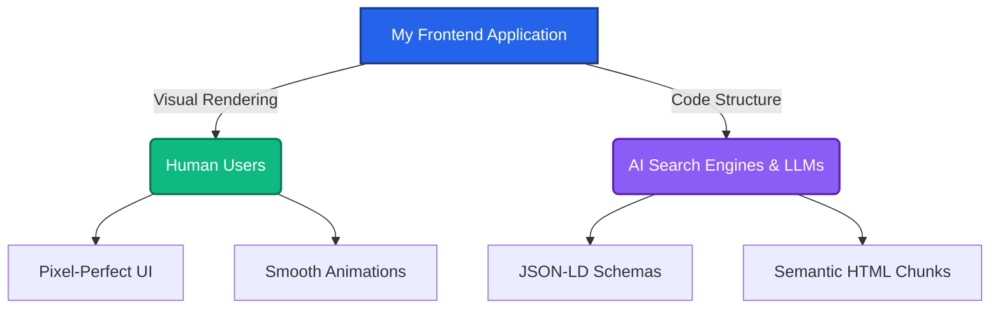
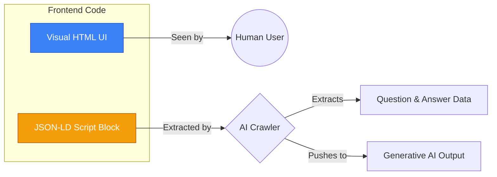

# 🚀 Part B: Discovery Architecture (AEO & GEO) Implementation

Welcome to **Part B** of the Frontend & Growth Engineering Assessment! 

This section covers my R&D on **Answer Engine Optimization (AEO)** and **Generative Engine Optimization (GEO)**, and how I translated these modern search concepts into a pixel-perfect, highly optimized frontend implementation. 

---

## 💡 1. What I Figured Out (The R&D Summary)

Search engines are changing. Instead of just giving users a list of blue links, AI engines (like Google AI Overviews, Perplexity, and ChatGPT Search) now **read, summarize, and generate direct answers**. 

To survive in this new AI era, a website must be optimized for two completely different audiences:
1. **The Human User:** Needs a beautiful, fast, and responsive UI.
2. **The AI Crawler (LLM):** Needs highly structured, readable, and "chunkable" data.

### The Dual-Audience Architecture



---

## 🛠️ 2. How I Implemented AEO & GEO in the Frontend

Knowing *how* AI works is only half the battle. Here is exactly how I implemented these growth engineering concepts into the actual frontend code of this repository:

### A. Semantic "Chunking" (Designing for RAG)
AI systems use Retrieval-Augmented Generation (RAG). They don't read entire pages; they break pages down into small 200-500 word "chunks". If a chunk doesn't make sense on its own, the AI ignores it.

* **My Implementation:** I strictly used HTML5 semantic tags (`<article>`, `<section>`, `<aside>`) and logical `<h1>` to `<h6>` hierarchies. Every UI component is built so that the text inside it acts as a self-contained, meaningful block of information.

### B. Speaking the AI's Language (JSON-LD Schemas)
AI bots shouldn't have to guess what a page is about. We need to feed them the exact data they want.

* **My Implementation:** I integrated hidden `<script type="application/ld+json">` tags. For example, if there is a Q&A section in the UI, there is a corresponding `FAQPage` schema in the background. This directly signals to AI engines that the content is a verified answer.



### C. The "Position Zero" UI Block
AI engines love extracting short, direct answers to show at the very top of search results (Featured Snippets / Zero-Click searches).

* **My Implementation:** I designed dedicated "Direct Answer" UI blocks at the top of informational sections. These blocks contain crisp, 50-70 word summaries that visually look great to humans and are perfectly formatted for AI extraction.

### D. Core Web Vitals & Crawl Budgets
AI crawlers are impatient. If a site is slow, they leave without reading the data. 

* **My Implementation:** I focused on keeping the DOM lightweight and optimizing assets to ensure a blazing-fast **LCP (Largest Contentful Paint)**. A faster site means a higher crawl rate from AI bots.

---

## 💻 3. Run the Project Locally

```bash
# Clone the repository
git clone [https://github.com/04shubham7/PixelGEO.git](https://github.com/04shubham7/PixelGEO.git)

# Navigate into the directory
cd PixelGEO

# Install dependencies
npm install

# Start the development server
npm run dev
```

---
### E. AI-Friendly Crawler Configuration (`robots.txt`)
Many websites accidentally block AI crawlers with outdated wildcard directives. 
* **My Implementation:** I added a custom `robots.txt` file in the public directory that explicitly whitelists modern LLM crawlers (`GPTBot`, `ClaudeBot`, `PerplexityBot`, etc.) to ensure the site's semantic chunks are actually ingested by generative engines.

## 🎯 Final Thoughts

Building this frontend taught me that **Growth Engineering and Frontend Engineering go hand-in-hand**. By combining a responsive, pixel-perfect design with deep AEO/GEO structural optimizations, this project demonstrates a future-proof approach to modern web development. It looks great to humans, and it reads perfectly to machines.
